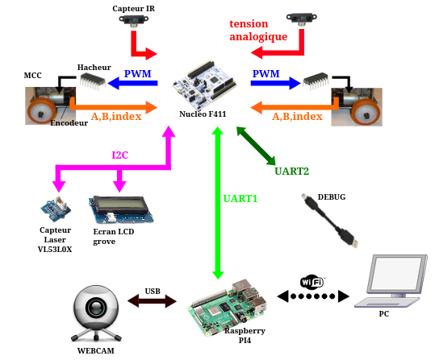

# Projet : Programmation d’un Robot Autonome avec Interface de Commande

## Objectif

Ce projet vise à programmer un robot autonome et son interface de commande avec les modes de fonctionnement suivants :  

1. **Mode Manuel**  
   - Commande à distance de la direction et de la vitesse de déplacement.  
   - Détection d’obstacles.  

2. **Mode Aléatoire**  
   - Déplacement libre du robot.  
   - Détection d’obstacles et changement régulier de direction.  

3. **Mode Tracking**  
   - Suivi d’une cible (couleur) détectée par la caméra.

---

## Éléments constituants le système

### Images du système
- 

### Présentations des composants

#### STM32 Nucleo F411
- **Gestion des moteurs** en boucle fermée.
- **Acquisition des capteurs de distance**.  
- **Affichage** sur écran LCD.  
- **Communication** avec le Raspberry Pi.  

#### Raspberry Pi
- **Acquisition d’image** via une Webcam.  
- **Traitement d’image** pour le suivi de cible.  
- **Communication** avec le PC via WiFi.  

#### Interface Homme-Machine (IHM) sur PC Host
- **Définition des modes de fonctionnement** du robot.  
- **Transmission des ordres** de direction et de vitesse.  
- **Affichage des valeurs des capteurs**.  
- **Visualisation en temps réel** de l’image de la Webcam.  

---

## Contraintes

1. Les échanges de messages entre les différents processeurs utilisent le formalisme **ROS2**.  
2. Le système embarqué sur la **STM32** utilise un **système d’exploitation temps réel (RTOS)**.  

---

## Configuration et Installation

### Prérequis
- STM32 Nucleo F411 avec RTOS installé.
- Raspberry Pi avec support ROS2 et traitement d’images.
- Webcam compatible avec Raspberry Pi.
- Écran LCD pour STM32.
- PC Host avec IHM installée.

### Instructions
1. **Cloner le dépôt**  
   ```bash
   git clone https://github.com/votre-nom-utilisateur/nom-du-repo.git
   cd nom-du-repo

